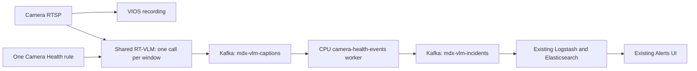

<!--
SPDX-FileCopyrightText: 2026 the VSS application contributors
SPDX-License-Identifier: Apache-2.0
-->

# Camera Health and Tampering on the shared stack

Live playback results and measured latency are recorded in [VALIDATION.md](VALIDATION.md).

One camera-specific Alert Bridge rule checks all four camera-health conditions
in a single Cosmos Reason 3 Nano call per video window. The model returns a
JSON object with one string class: the most likely primary cause supported
by visible evidence in the window. `healthy` represents a usable view or
insufficient evidence and produces no alert. If impairments coexist, the
model selects the one with the strongest evidence and greatest sustained
loss of useful view. A visibly covering object takes precedence over the
darkness or glare it causes; the mapper never picks the first item of a list.

```json
{"class":"view_obstruction"}
```

| Class | Detection condition |
| --- | --- |
| `view_obstruction` | A nearby foreign object persistently blocks a substantial part of the view. |
| `bright_light_interference` | Intense glare or overexposure prevents useful observation. |
| `camera_view_changed` | Camera movement shifts static background landmarks together within the window. |
| `illumination_too_low` | Sustained darkness prevents useful observation of the scene. |
| `healthy` | No clearly supported impairment; no incident is emitted. |

## Pipeline



The deployed RT-VLM real-time trigger searches for `yes`/`true` and supplies
one fixed category. This application therefore reads the existing caption
topic and translates a positive scalar class into exactly one `nv.Incident`
per window. Healthy windows produce none. It requires no additional VLM
inference. The worker uses the already cached RT-VLM image solely for Python,
Kafka, and NvSchema dependencies; it receives
no GPU devices, model volumes, or model-loading command.

This deployment also opts into a bounded FFprobe RTSP metadata reader because
the native hardware-backed discovery probe blocked new stream admission on
this host. Its codec installer includes FFprobe's audio/device library dependencies.
The live hardware decoder also blocked on this SBSA host, which reports no
NVDEC engines. The overlay selects CPU H.264/H.265 decoding using GStreamer
feature ranks; conversion into GPU memory and inference still use the shared GPU.
Applying these runtime mounts/environment
requires recreating RT-VLM and briefly interrupts shared monitoring. The
Alert Bridge admission timeout is raised to 45 seconds. VIOS also uses its
software media path (`data.use_software_path: true`) on this host so recorded
preview images can be decoded; its hardware preview path timed out with HTTP
500. The stock metadata
backend remains the default outside this overlay.

Both prompt strings must match this application's configuration before a
caption is processed. Hailing/collapse captions are ignored. Complete JSON
is validated against the four impairment labels and `healthy`. Arrays,
multiple labels, duplicate JSON keys, and extra fields are rejected;
malformed, unknown, or truncated results are logged as invalid and recorded
in the audit file. Invalid output is not counted as a healthy window.
The original response, sensor, timestamps, frame IDs, and request/window
identity are retained on every incident. Kafka offsets are committed after
incident delivery is acknowledged. Retries can repeat deliveries; the
existing Logstash fingerprint includes timestamp, category, and sensor and
therefore gives each selected class its own stable Elasticsearch document
identity.

The request specifies four-second windows with two-second overlap, four sampled
frames per second, 960 × 540 input, greedy decoding, reasoning disabled, and
64 maximum output tokens. `response_format` constrains JSON with the class
enum. Definitions and inference parameters are in `camera-health.json`.
The deployed live decoder emitted windows approximately every four seconds
during validation; use the measured cadence when estimating alert delay.

## Prepare and start

From the repository root, use the latest resolved shared stack so its existing
retention, network, credentials, and transport settings are preserved:

```bash
python3 deploy/docker/applications/camera-health/prepare.py \
  --base-compose _builds/shared-safety-alerts-retention/resolved.yml \
  --build-dir _builds/camera-health \
  --video /home/awiros-tech/Projects/VSS_Apps/camera_tampering_videos/camera-health-29sep26.mp4 \
  --mediamtx _builds/shared-safety-alerts/mediamtx

docker compose -f _builds/camera-health/resolved.yml \
  run --rm --no-deps kafka-topic-init-container

# Apply during an agreed monitoring interruption; wait for model warmup.
docker stop -t 10 vss-alert-bridge
docker compose -f _builds/camera-health/resolved.yml \
  up -d --no-deps --wait --wait-timeout 480 rtvi-vlm
docker compose -f _builds/camera-health/resolved.yml \
  up -d --no-deps --wait --wait-timeout 45 alert-bridge camera-health-events

python3 deploy/docker/applications/camera-health/play-once.py \
  --build-dir _builds/camera-health \
  --host 10.15.16.210 --sensor-name camera_health_29sep26
```

The preparer refuses to overwrite a build. It snapshots the small application
files, adds the CPU worker and stream-admission/decoding overrides to the existing Compose project, validates
Compose, checks the Linux ARM64 MediaMTX 1.21.1 binary digest, and makes an
H.264/25 FPS/960 × 540 playback copy. Source video is untouched. Resolved files
are mode 0600 and remain in ignored `_builds/` along with recordings and audit
evidence. The worker inherits Kafka endpoints/topics from the shared RT-VLM
configuration and is limited to one CPU and 512 MiB memory.
The overlay includes the configured RT-VLM diagnostics topic in Kafka topic
initialization and readiness checks. The shared base omitted `mdx-vlm-errors`,
which caused Kafka metadata waits when a finite source disconnected.

The playback helper uses the host-side `vss` configuration and `vss vios add`
for explicit source onboarding. It creates the rule through Alert Bridge,
publishes the video once, and uses an independent RTSP reader to check EOS.
It never loops or automatically replays a video, and refuses an existing
`playback-test/` directory. It fails the test if no classifications arrive
within 90 seconds or playback produces no valid classifications.
Rule admission starts after publishing, so the
first few seconds may not be analyzed. Failed admission is saved as evidence;
to deliberately rerun after fixing a failure, retain the failed directory
under another name and pass `--sensor-id` with the ID that onboarding returned.
This reuses the original registered sensor instead of adding a duplicate.

After playback, the saved rule remains visible in **Alerts → Manage Alerts →
Real-time Alerts**. The source is offline after EOS; the stock rule API's
`active` status describes the saved rule, not a continuing finite-video feed.
Select camera `camera_health_29sep26` in **View Alerts**, use a one-day query
range, and enable **VLM Verified** to inspect class-specific incidents.

For a continuous camera, register its actual RTSP stream in VIOS and create
one real-time rule using the same `params`, `alert_type: Camera Health`, the
advertised shared model, and the sensor ID/name and live stream URL. Start the
worker before admitting the rule. Prompt changes require updating the worker's
snapshot and the rule together because prompt matching is the opt-in contract.

## Verification and limits

`test_camera_health.py` verifies healthy output, all four scalar classes,
rejection of legacy/multiple-class arrays, schema agreement, malformed
responses, ignored legacy prompts, source identity, timestamps, protobuf
serialization, and independence of emitted metadata.
Run it in the cached runtime image without a network or GPU:

```bash
docker run --rm --network none --entrypoint python3 \
  -e PYTHONPATH=/opt/nvidia/rtvi/rtvi \
  -v "$PWD/services/rtvi/rt-vlm/src/server/camera_health.py:/opt/nvidia/rtvi/rtvi/server/camera_health.py:ro" \
  -v "$PWD/deploy/docker/applications/camera-health/test_camera_health.py:/tmp/test_camera_health.py:ro" \
  -v "$PWD/deploy/docker/applications/camera-health/camera-health.json:/tmp/camera-health.json:ro" \
  ghcr.io/nvidia-ai-blueprints/vss/vss-rt-vlm:develop-4c432f24cf39-sbsa \
  /tmp/test_camera_health.py -v
```

`test_rtsp_probe.py` checks bounded TCP discovery, metadata validation, safe
timeout diagnostics, and preservation of the default backend. Run it in the
same image with `media_file_info.py` mounted at
`/opt/nvidia/rtvi/rtvi/utils/media_file_info.py` and the test mounted at `/tmp/`.

The worker's `event-evidence/windows.jsonl` records both healthy and positive
windows using a scalar `class` (`null` for invalid output), JSON validation
failures, raw responses, token usage, Kafka offsets,
and processing timestamps. `playback-test/results.json` records rule admission,
single-pass playback, EOS, and the Alert Bridge incident query.

This implementation identifies visible impairment, without establishing
intentional tampering. It detects camera movement within each window; it does
not compare an already displaced static view with a saved reference. Black
footage cannot always distinguish a covered lens from missing illumination.
The default emits raw positive windows. Event consolidation is available
through the existing incident API; persistence thresholds, recovery alerts,
and per-camera day/night calibration are separate extensions. One recording
validates operation on that recording, not general detection accuracy.
